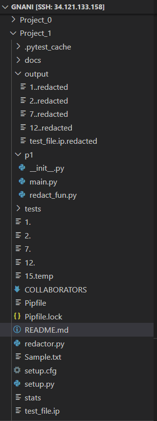
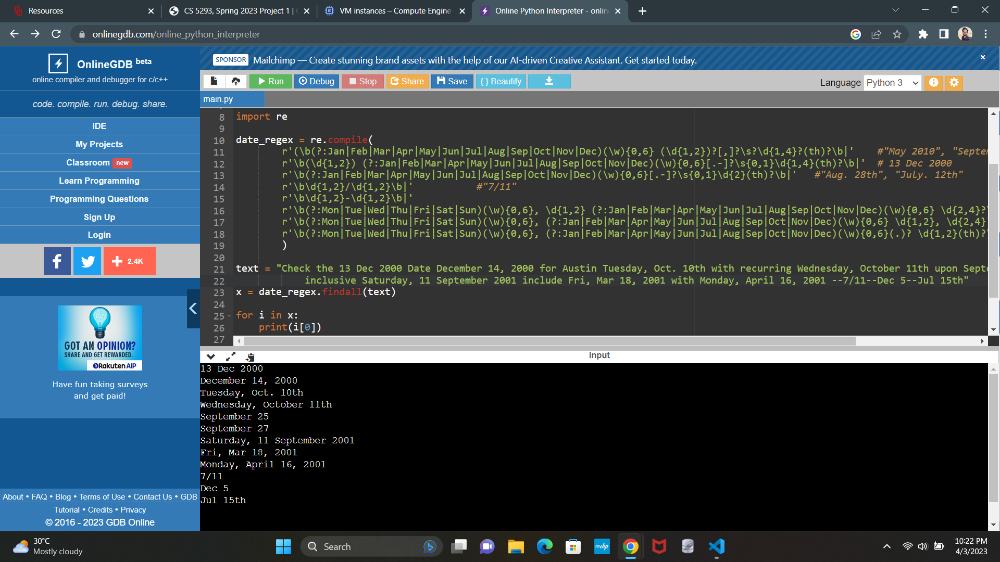
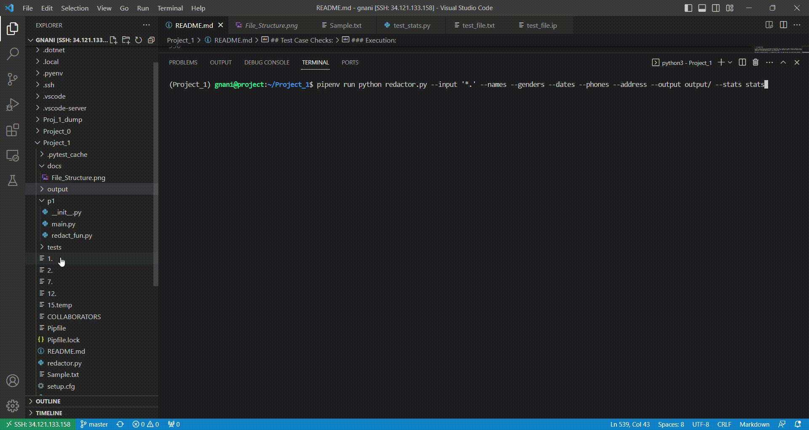
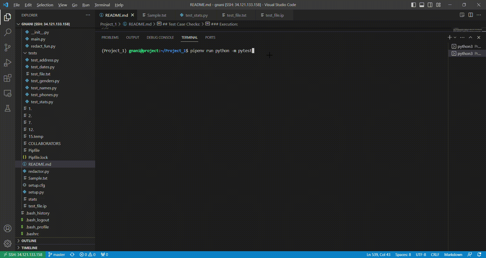

In this project, we redact the specified information in the given document or text. Based on given filter, various functions perform redaction. 

#### Steps followed:

1. Validate if there exists required filters in the argument list. As --input is mandatory, we proceed only if it's parameter is available.
2. Identify the file pattern (.txt, a., .sample etc.)
3. Use glob to extract all the files with identified pattern using the glob expression - "main_folder/**/pattern". Save all files to a list.
4. Check if output path exists in the file system. If not, create a directory.
5. Traverse through all files in the list. Initially, read each file content and pass it as an argument to each function which in turn redacts the content.
6. To maintain the continuity, pass the output of each function to the following function. This helps while using only few filters for the process of redaction.
7. Obtain the result, summary from each function. 
8. Write the redacted result to given file path and pass the list of summaries to stats function which writes the statistics summary to the file specified in arguments.

##### Modules and Installation

1. argparse - It helped in handling the aruments passed to the redaction program. It is used to validate the filters and their parameters, parsing the sys.argv list.

It's a python standard library.

```
        import argparse

```

2. spacy - It is a natural language processing (NLP) library whcih helps in analysing and processing large datasets (text). It provides an various APIs which allow us to build various NLP applications such as named entity recognition, part-of-speech tagging, and dependency parsing.

To install :

- Open command prompt
- pip install spacy

3. glob - It helps us in searching for files that match a specified pattern. It is used to traverse through a directory structure and retrieve files that match a specific pattern.(Also within sub folders).

It's a python standard library.

```
        import glob

```
4. re - It helps us in working with regular expressions. It provides various functions to work with regular expressions such as matching, searching, and replacing. We used it to match Date, phone number formats.

It's a python standard library.

```
        import re

```

5. os - It helps us in dealing with operating system dependent functionality like reading or writing to the file system, creating new directories, finding current path, validating if a file or directory exists in the file system etc.

It's a python standard library.

```
        import os

```

6. sys - It helps us in working with some variables and functions used or maintained by the interpreter. Mainly we used it to consider sys.argv and their processing. Moreover, it helped in processing Standard input, output and error streams.

It's a python standard library.

```
        import sys

```

7. Models - en_core_web_md, en_core_web_sm

These are pre-trained statistical models for English language processing in spacy library. It contains word vectors and supports many features such as named entity recognition, part-of-speech tagging, dependency parsing, and more.

To download the model and its dependencies and add them to project's virtual environment:

```
        pipenv run python -m spacy download en_core_web_md

```

To load the model:

```
        spacy.load("en_core_web_md")

```

##### File Structure Snap



#### Function - "names(i_file, document, args.output)"

Input Parameters: 

i_file -> Input file 
document -> The content of input file (string)
args.output -> The output directory specified in argument list for --output

Return Values:

document -> Redacted content (String)
l -> Summary of function (String)

We download, install and load the model (English) and pass the document data as input to it. The model has pre defined functions which helps in identifying the valuable information from the provided input. 

```
nlp = spacy.load('en_core_web_md') 
replacement_char = u"\u2588"

Names = []
doc = nlp(document)

```

Based on "doc.ents", we consider Named Entity Recognition to capture the names of persons and organizations. Identified names are appended to a list (Names) which is used to describe the summary of the function.

```
for ent in doc.ents:                                        # Entity Capture
        if ent.label_ == "PERSON" or ent.label_ == "ORG":       
            Names.append(ent) 
    
    Names = list(set(Names))
    document = str(doc)

```

A special block character ("\u2588") has been used to perform the redaction. Here, each character of name in the list has been replaced with the specified character using re.sub(). 

Note : re.escape(string)

With above considered assumption - re.escape(string), some of the names has been left without being redacted.

```

for i in Names: 
        document = re.sub(r'\b{}\b'.format(re.escape(str(i))), replacement_char * len(str(i)), document)

```

We save the resultant string to the same variable - document. Now, we take the identical words redacted to write the summary.

```
Names = list(set([str(i).strip() for i in Names]))      # Unique words found

    # Summary String
    l = "File : '{}'\n  Redacted Entities : NAME\n  Destination : '{}'\n  Words Redacted = {}\n  Words = {}\n  Characters Redacted = {}\n\n".format(file_name,out_folder,len(Names), list(set(Names)),sum(len(s) for s in Names))
    return (document,l)

```

Finally, we retrun the redacted string as document and the summary string (It consists of File Name, Entity Redacted, Destination of the output file, Number of words redacted, Number of characters redacted)


#### Function - "genders(i_file, document, args.output)"

Input Parameters: 

i_file -> Input file 
document -> The content of input file (string)
args.output -> The output directory specified in argument list for --output

Return Values:

document -> Redacted content (String)
l -> Summary of function (String)

This function helps us in redacting the gender entities of the words found in the text document. Here, the Pronouns help us in identifying the gender of the persons in the data set. In addition, list of nouns which are gender specific in nature are used to match the coresponding words. We consider these both cases to extract the list of gender entities and replace them with Block character.


```
pronouns = ['dad','mr.','male','man','boy','father','son','brother','uncle','grandfather','boyfriend','husband','guy','dude','bachelor','businessman','king','prince','lord','sir','actor','host','waiter','mrs.','ms.','mom','female','woman','mother','Daughter','sister','aunt','grandmother','girlfriend','wife','lady','girl','princess','queen','actress','maid','lady-in-waiting','mother','waitress','hostess']

    for i in gen_doc:                                     
        if i.pos_ == 'PRON':            # Capturing Pronouns
            Gend.append(i)

```
Considering POS (Parts of Speech) tagging, we capture the tokens of the text which are Pronouns which can be identified by using 'pos_' attribute. Pronouns are considered as they represent the gender of entities in sentences.

Moreover, there exists some Common nouns in our generic sentence structure like - Father, Daughter, Mother etc. These common nouns represent the gender of a person for which a generic list of pronouns has been used. If the word is available in the list, it will be redacted.

```
    for i in gen_doc:
            if i.pos_ == 'NOUN' and str(i).lower() in pronouns:         # Validating nouns which exists in the list
                Gend.append(i)

        for j in list(set(Gend)):
            document = re.sub(r'\b{}\b'.format(re.escape(str(j))), replacement_char * len(str(j)), document)
```

Finally, we retrun the redacted string as document and the summary string (It consists of File Name, Entity Redacted, Destination of the output file, Number of words redacted, Number of characters redacted).


#### Function - "dates(i_file, document, args.output)"

Input Parameters: 

i_file -> Input file 
document -> The content of input file (string)
args.output -> The output directory specified in argument list for --output

Return Values:

document -> Redacted content (String)
l -> Summary of function (String)

This function helps in detecting the dates pattern in the text document. Here, 're' module has been used for capturing various date formats in the "mail_dir" folder.

Some example include : # "May 2010" / "September 22" / Dec 5 / July 15th / December 14, 2000 / Saturday, 11 September 2001  /  Monday, April 16, 2001 / "7/11" / 25-02 / "Aug. 28th" / "July. 12th"

These are the date formats referred from the path : "Proj_1_dump/maildir/allen-p/all_documents"

```

date_regex = re.compile(
        r'(\b(?:Jan|Feb|Mar|Apr|May|Jun|Jul|Aug|Sep|Oct|Nov|Dec)(\w){0,6} (\d{1,2})?[,]?\s?\d{1,4}?(th)?\b|'  # "May 2010" / "September 22" / Dec 5 / July 15th / December 14, 2000
        r'\b(\d{1,2}) (?:Jan|Feb|Mar|Apr|May|Jun|Jul|Aug|Sep|Oct|Nov|Dec)(\w){0,6}[.-]?\s{0,1}\d{1,4}(th)?\b|'  # 13 Dec 2000
        r'\b(?:Jan|Feb|Mar|Apr|May|Jun|Jul|Aug|Sep|Oct|Nov|Dec)(\w){0,6}[.-]\s{0,1}\d{2}(th)?\b|'   # "Aug. 28th", "July. 12th"
        r'\b\d{1,2}/\d{1,2}\b|'           #"7/11"
        r'\b\d{1,2}-\d{1,2}\b|'             # 25-02
        r'\b(?:Mon|Tue|Wed|Thu|Fri|Sat|Sun)(\w){0,6}, \d{1,2} (?:Jan|Feb|Mar|Apr|May|Jun|Jul|Aug|Sep|Oct|Nov|Dec)(\w){0,6} \d{2,4}?\b|'     # Saturday, 11 September 2001    /   Monday, April 16, 2001
        r'\b(?:Mon|Tue|Wed|Thu|Fri|Sat|Sun)(\w){0,6}, (?:Jan|Feb|Mar|Apr|May|Jun|Jul|Aug|Sep|Oct|Nov|Dec)(\w){0,6} \d{1,2}, \d{2,4}?\b|'    # Fri, Mar 18, 2001   /   
        r'\b(?:Mon|Tue|Wed|Thu|Fri|Sat|Sun)(\w){0,6}, (?:Jan|Feb|Mar|Apr|May|Jun|Jul|Aug|Sep|Oct|Nov|Dec)(\w){0,6}(.)? \d{1,2}(th)?\b)'     # Wednesday, October 11th   /   Tuesday, Oct. 10th
        )
```



It extracts the matching sequences of dates and saves them to a list which can be used to replace the characters of it's items with Block character.

```
Date_format = date_regex.findall(document)
    Dates = []
    for i in date_format:
        Dates.append(i[0])
        
    for k in Dates:
        document = re.sub(r'\b{}\b'.format(re.escape(k)), replacement_char * len(k), document)

```
Finally, we retrun the redacted string as document and the summary string (It consists of File Name, Entity Redacted, Destination of the output file, Number of words redacted, Number of characters redacted).


#### Function - "phones(i_file, document, args.output)"

Input Parameters: 

i_file -> Input file 
document -> The content of input file (string)
args.output -> The output directory specified in argument list for --output

Return Values:

document -> Redacted content (String)
l -> Summary of function (String)


This function helps in detecting the phone number pattern in the text document. Here, 're' module has been used for capturing various phone number formats in the "mail_dir" folder.

Some example include : #+1 212 641-6663 / +44 207 783 2071 /(212-310-8000) / 212-310-8000 / 212-310-8000. / 212 469 5673,12 469-5673 / 713-853-1507) / =713) 646-3302 / 713) = 507-6466

These are referred from the folders : "docs/maildir/arora-h/"

```
phone_regex = re.compile(
        r'(\b\+?\d{1,3}\s?\(?\d{1,3}\)?[\s-]\d{3,4}[\s-]?\d{4}\b|'   #+1 212 641-6663,+44 207 783 2071
        r'\b\d{1,3}(\))?\s?(=)?[.\s-]?\d{1,3}[.\s-]\d{1,6}\b|'     #(212-310-8000),212-310-8000,212-310-8000. / 212 469 5673,12 469-5673, 713-853-1507),=713) 646-3302,713) = 507-6466
        r'\b\d{1,4}\s?\d{1,5}?\s?\d{1,5}?\b|' 
        r'\b\d{1,3}[\s-]\d{1,5}[\s-]\d{1,45\b|'         # 91-11455-25683
        r'\b\d{1}-\d{4}\b)'                             # 3-5083
        )
```

Assumption : There exists some phone numbers of length more than 14 digits (i.e., 011442077834188), 8 digits (i.e,12831939). To include them a generalized pattern has been considered which extracts the number in the message id fields of the text document.

Even though few numbers have been split to parts while using the "re.compile" with the regular expression, all the detected sequences are being redacted.


findall() is used to capture all the occurrences of phone numbers that match the regular expressions. All these sequences are replaced by the Block character.

```
phone_format = phone_regex.findall(document)

    Phone = []
    
    for i in phone_format:
        Phone.append(i[0])
    
    for k1 in list(set(Phone)):
        document = re.sub(r'\b{}\b'.format(re.escape(k1)), replacement_char * len(k1), document)

```

Finally, we retrun the redacted string as document and the summary string (It consists of File Name, Entity Redacted, Destination of the output file, Number of words redacted, Number of characters redacted).


#### Function - "addresses(i_file, document, args.output)"

Input Parameters: 

i_file -> Input file 
document -> The content of input file (string)
args.output -> The output directory specified in argument list for --output

Return Values:

document -> Redacted content (String)
l -> Summary of function (String)

This function helps in finding the sequences of Address entities from the text documnet. Here, we consider the nlp processing of text document through the model used. Entities with properties of ADDRESS & GPE have been used to identify the word sequences. 

Moreover, a generic list of words in addresses has been created and used to identify words matching the list. These are appended to a list.

```
Addr = []
    # Generallt used address entities
    lanes = ['north','south','east','west','circle','lane','floor','street','ave','blvd','avenue','st.','rd.','road','av.','ave.']
    
    for i in addr:
        if str(i).lower() in lanes:
            Addr.append(i)

    for ent in addr.ents:
        if ent.label_ == "ADDRESS" or ent.label_ == "GPE":      # Capturing Spacy address entities
            Addr.append(ent.text)
```

Each word of this list has been iterated to replace all characters of each word with block character.

```
for a in Addr:
        document = re.sub(r'\b{}\b'.format(re.escape(str(a))), replacement_char * len(str(a)), document)

```
Assumption: Here, some words like Names, Organizations in the address have been already redacted with the --names flag if it was used before --address. So, only few tokens are redacted in such cases.

Finally, we retrun the redacted string as document and the summary string (It consists of File Name, Entity Redacted, Destination of the output file, Number of words redacted, Number of characters redacted).

#### Function - "stats(file_name, summary)"

Input Parameters: 

file_name -> File name where the statistics summary to be printed 
summary -> List of summary strings derived from each flag function

Return Values:

This writes the summary of the functions used to the mentioned file name.

```
        def stats(file_name, summary):                          # stats file taking summary as list of strings            

        with open(file_name, 'a') as f:                     # Writing summary to the file - argument passed
                for i in summary:
                f.write('  '+i+'  ')
                f.write('\n\n')
```
Here, we have appended the summary of the functions in file provided. This makes sure that statistics of all the files being preserved, so that it is helpful to check various file types with different patterns.

#### Function - "ip(file_name, document, out_folder)"

Input Parameters: 

i_file -> Input file 
document -> The content of input file (string)
args.output -> The output directory specified in argument list for --output

Return Values:

document -> Redacted content (String)
l -> Summary of function (String)

This function helps in finding the I.P Address sequences from the text documnet. Here, we considered regular expressions to match the I.P Addresses (i.e., 125.250.1.3). This has been used for testing the stats function. The sample file contains a list of I.P Addresses which are captured using the regex and the summary of these details has been written to the output file.

```
        ip_regex = re.compile(
                r'(\b\d{1,3}[.]\d{1,3}[.]\d{1,3}[.]\d{1,3}\b)')           # I.P Address
```

```
        ip_format = ip_regex.findall(document)

    for i in ip_format:
        IP.append(i)
        
    for k in IP:
        document = re.sub(r'\b{}\b'.format(re.escape(k)), replacement_char * len(k), document)
        
    l = "File : '{}'\n  Redacted Entities : IP Addresses\n  Destination : '{}'\n  Words Redacted = {}\n Unique Words = {}\n  Characters Redacted = {}\n\n".format(file_name,out_folder,len(IP),list(set(IP)),sum(len(s) for s in IP))
```

Here, all the sequences will be captured and can be redacted using the Block character. The result of this function is a redacted string and summary string.


Test Case Checks:
---------------

#### Function - test_name()

This function helps in validating the functionality of the redact names. We created a sample file- "tests/test_file.txt" (available in tests directory) which has been used to test the working of names() function. Upon reading the data from given file, names are redacted and result values have been saved in 2 variables. Here, the validation of return values (redacted string and summary string) is specified. The type of result string should be string with length > 0 and summary string should contain input_file name in it.

```
        result, app_data = names(i_file, result, i_out)

        assert type(result)==str and len(result)>0 and type(app_data)==str and (i_file in app_data)
```
#### Function - test_date()

This function helps in validating the functionality of the redact dates. We created a sample file- "tests/test_file.txt" (available in tests directory) which has been used to test the working of dates() function. Upon reading the data from given file, dates are captured by the regular expression and replaced withBlock character, result values have been saved in 2 variables. Here, the validation of return values (redacted string and summary string) is specified. The type of result string should be string with length > 0 and summary string should contain output_file name in it. Summary looks like:

```
        File : '/home/gnani/Project_1/15.temp'
        Redacted Entities : DATES
        Destination : 'output/'
        Words Redacted = 5
        Words = ['08/09', '08/03', '08/29', 'Wed, 29 Aug 2001']
        Characters Redacted = 36
```

```
        result, app_data = dates(i_file, result, i_out)
        assert type(result)==str and len(result)>0 and type(app_data)==str and (i_out in app_data)
```

#### Function - test_gender()

This function helps in validating the functionality of the redact genders. We created a sample file- "tests/test_file.txt" (available in tests directory) which has been used to test the working of genders() function. Upon reading the data from given file, gender patterns have been identified using the PRON label of POS tagging and generic list of gender specific nouns, result values have been saved in 2 variables. Here, the validation of return values (redacted string and summary string) is specified. The type of result string should be string with length > 0 and summary string should contain input_file name in it. Summary looks like:

```
        File : '/home/gnani/Project_1/15.temp'
        Redacted Entities : GENDER
        Destination : 'output/'
        Words Redacted = 2
        Words = ['us', 'I']
        Characters Redacted = 3
```

```
        result, app_data = genders(i_file, result, i_out)
        assert type(result)==str and len(result)>0 and type(app_data)==str and (i_file in app_data)
```

#### Function - test_phones()

This function helps in validating the functionality of the redact phone numbers. We created a sample file- "tests/test_file.txt" (available in tests directory) which has been used to test the working of phones() function. Upon reading the data from given file, regular expressions are used to identify the sequences of phone numbers in the given text and replaced with Block character, result values have been saved in 2 variables. Here, the validation of return values (redacted string and summary string) is specified. The type of result string should be string with length > 0 and summary string should contain output_file name in it. 

```
            def test_phone():

                i_file = '/home/gnani/Project_1/tests/test_file.txt'
                i_out = 'testing'

                with open(i_file, "r") as file:                                # File processing with spacy
                        #doc = nlp(file.read())
                        result = file.read()

                result, app_data = phones(i_file, result, i_out)

                assert type(result)==str and len(result)>0 and type(app_data)==str and (i_out in app_data)
```

#### Function - test_addresses()

This function helps in validating the functionality of the redact addresses. We created a sample file- "tests/test_file.txt" (available in tests directory) which has been used to test the working of address() function. Upon reading the data from given file, some tokens from POS tagging are used to identify the address and also a generic list of words like (street, avenue, road etc.) have been used to capture and substitue with blcok character, result values have been saved in 2 variables. Here, the validation of return values (redacted string and summary string) is specified. The type of result string should be string with length > 0 and summary string should contain input_file name in it. 

```
        result, app_data = addresses(i_file, result, i_out)

        assert type(result)==str and len(result)>0 and type(app_data)==str and (i_file in app_data)
```

#### Function - test_stats()

This function helps in validating the functionality of the statistics file.

i_file = '/home/gnani/Project_1/tests/test_file.txt' - This is the sample test file to validate the summary
i_out = 'testing_stats.txt' - This is the output path to save the summary of test function (dates)

Note: dates() has been used to check the validation of the stats file. The summary from the dates function is being returned to the output file specified in the test_stats(). stats(i_out, app_data) calls the function to write the summary to the output path.

To validate the working of stats function, we checked if the outpath is being created and length of the file > 0, using os module.

test_stats.py :

```
        with open(i_file, "r") as file:                                # File processing with spacy
            #doc = nlp(file.read())
            result = file.read()

        result, app_data = dates(i_file, result, i_out)                 # Statistics test with 'dates' redaction
        stats(i_out, app_data)

        assert os.path.exists(i_out) and  len(i_out > 0)     # Validating if result is being copied to the output path for statistics
```

### Execution:

We provide the argument list as input through command prompt.

We create respective folders in the folder path (docs, tests, etc. as required).

redactor.py - overall view of functions involved in this project.

redact_fun.py - This file is available in p1 folder and it contains the detailed code snippets for the function specified in redactor.py

tests : test_*.py - It contains all the tests required to validate the working of functions using a sample "filetest_file.txt". This file is located in tes tests path.

docs - This folder contains all the screenshots/gifs to show execution of the project.


We run the main.py using the below command:

Command - 

```
pipenv run python redactor.py --input '*.' --names --genders --dates --phones --address --output output/ --stats stats 

```
Here, --input flag should be given "file pattern" as parameter. --output flag should be given the directory as parameter to which redacted files to be written




It searches for the *. file pattern in the current working directory (which is used to run the redactor.py file) and saves them in a list and iterates the list to check for each flag / filter and performs redaction operation based on the flag. Summary from each function is stored in a list and when the --stats filter is available (args.stats), the list of strings is written to a file - /home/"gnani/"Project_1/testing_stats.txt". This command executes all filters in sequence, but we may specify only few flags and run the program to get specific redaction functioning.

Output - If a directory is not available in the file system, a new directory is created with the parameter name of '--output' flag and the redacted data string will be saved to this folder with extension - '.redacted'. Similarly, the summary of flags used in the command is written to a file name - which is taken as parameter to the "--stats" flag.

If a parameter isn't available for the --stats flag, sample summary is written to standard error.

######Assumptions:

1. re.escape(string) - It return string with all non-alphanumerics backslashed; this is useful if we need to match an arbitrary literal string that may have regular expression metacharacters in it. i.e, There exists some characters like (?,.) in the text which has special meaning in regular expressions. To nullify their presence, this has been used.

With above considered assumption - re.escape(string), some of the names has been left without being redacted.

2. Note: dates() has been used to check the validation of the stats file. The summary from the dates function is being returned to the output file specified in the test_stats(). stats(i_out, app_data) calls the function to write the summary to the output path.

3. Phone numbers with country codes starts with + symbol

4. Stats file which shows the summary is being appended to save the statistics of all files

5. Files used for testing : 1. / 2. / 7. / 12. / 15.temp / test_file.ip

6. Redacted files are saved in output directory which is passed as parameter to --output flag

7. statistics file format : It contains - Input File Name, Entitiy to be Redacted, Destination folder, Number of Words Redacted, Unique words redacted, Total number of characters redacted

8. If a parameter isn't available for the --stats flag, sample summary is written to standard error

9. While using the regular expression for Phone numbers, a pattern like (2000 04) is also being detected which was actually meant to extract phone numbers like "212 469 5673"

10. Stats function prints the total number of characters (Including repeated words) redacted.


Test Check - 

```
pipenv run python redactor.py --input '*.ip' --ip --phones --address --output output/ --stats stats
```

Above command has been used to check the new flag --ip which redacts the I.P Addresses.

```
import pytest
pipenv run python -m pytest

```

Output - It returns the status of test checks based on assert conditions mentioned in the test_*.py files

Execution Sample Gif:

